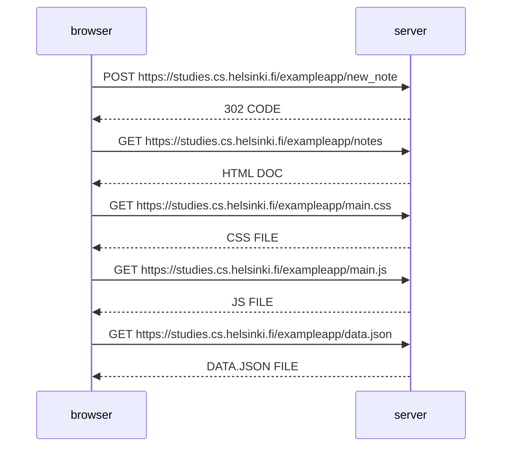

```mermaid
sequenceDiagram
browser->>server: POST https://studies.cs.helsinki.fi/exampleapp/new_note 
server-->>browser: 302 CODE
browser->>server: GET https://studies.cs.helsinki.fi/exampleapp/notes
server-->>browser: HTML DOC
browser->>server: GET https://studies.cs.helsinki.fi/exampleapp/main.css
server-->>browser: CSS FILE
browser->>server: GET https://studies.cs.helsinki.fi/exampleapp/main.js
server-->>browser: JS FILE
browser->>server: GET https://studies.cs.helsinki.fi/exampleapp/data.json
server-->>browser: DATA.JSON FILE
```
